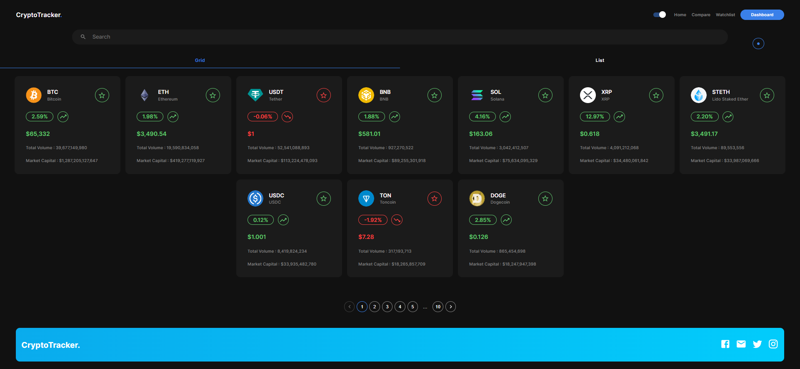
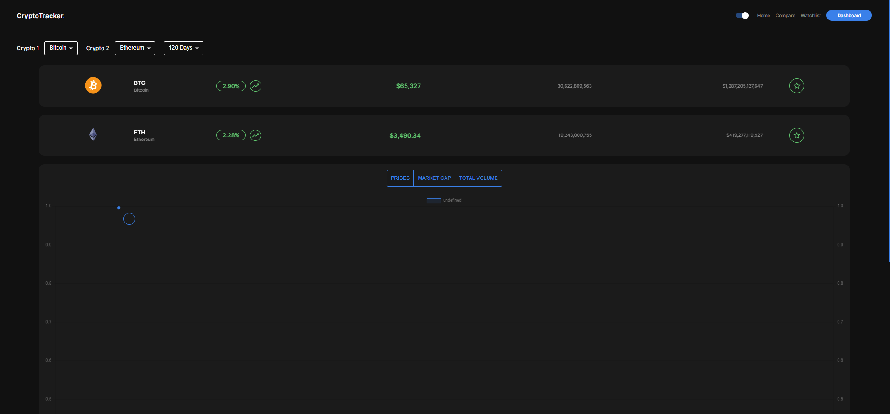
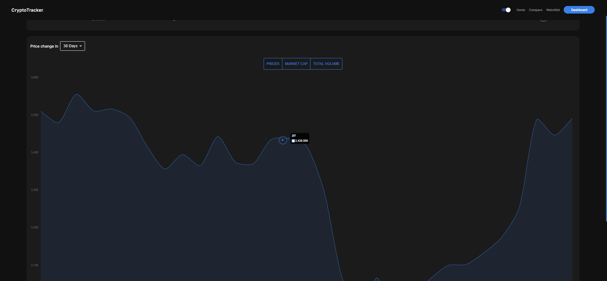
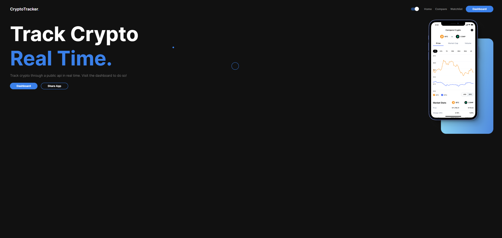
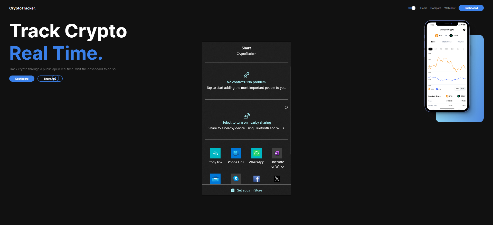
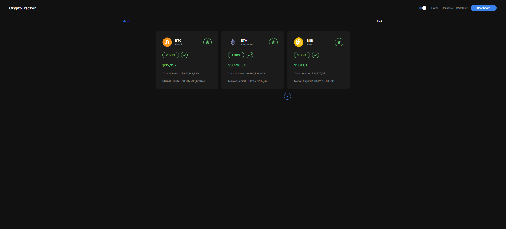

# CryptoTracker

CryptoTracker is a comprehensive cryptocurrency dashboard that allows users to track, compare, and analyze various cryptocurrencies in real-time. Built with React and Material-UI, this project offers a user-friendly interface for monitoring the crypto market.

## Features

- Real-time tracking of cryptocurrency prices
- Comparison of multiple cryptocurrencies
- Historical price charts (30-day view available)
- Grid view of top cryptocurrencies
- Mobile-friendly design
- Easy sharing functionality

## Screenshots

### Main Dashboard

The main dashboard displays current prices and 24-hour changes for selected cryptocurrencies.

### Compare

A grid view comparing multiple cryptocurrencies with key metrics.

### Price Chart

30-day price history chart for selected cryptocurrencies.

### Landing Page

The application's landing page with quick access to the dashboard.

### Share Functionality

Various options for sharing the application with others.

### Watchlist Functionality

Various options for sharing the application with others.

## Technologies Used

- React
- React Router
- Material-UI
- Chart.js
- Axios
- Framer Motion
- React Toastify

## API Integration

The project uses the CoinGecko API to fetch cryptocurrency data. Key functions include:

- `get100Coins`: Fetches top 100 cryptocurrencies
- `getCoinData`: Retrieves detailed data for a specific coin
- `getPrices`: Fetches historical price data for charting

## Usage

After starting the development server, open your browser and navigate to `http://localhost:3000` to use the application.

- Use the dashboard to view top cryptocurrencies
- Click on a cryptocurrency to view detailed information and charts
- Use the compare feature to analyze two cryptocurrencies side by side
- Add cryptocurrencies to your watchlist for quick access
- Toggle between dark and light modes for comfortable viewing

## Installation Guide

Follow these steps to set up the CryptoTracker project on your local machine:

1. **Clone the repository**
   Open your terminal and run the following command to clone the project:
2. **Navigate to the project directory**
Change into the project directory:
3. **Install Node.js and npm**
Ensure that you have Node.js and npm (Node Package Manager) installed on your system. You can download and install them from [https://nodejs.org/](https://nodejs.org/). We recommend using Node.js version 14.x or later.

4. **Install dependencies**
Install the project dependencies by running:This command will install all the necessary packages defined in the `package.json` file.

5. **Set up environment variables**
Create a `.env` file in the root directory of the project and add any necessary environment variables.Note: As of now, CoinGecko's public API doesn't require an API key, but this step is included for future-proofing.

6. **Start the development server**
Once the installation is complete, start the development server:This command runs the app in development mode.

7. **View the application**
Open your web browser and visit [http://localhost:3000](http://localhost:3000) to view the application.

8. **Build for production**
When you're ready to deploy the application, create a production build:This command builds the app for production to the `build` folder.

### Troubleshooting

- If you encounter any issues with dependencies, try deleting the `node_modules` folder and the `package-lock.json` file, then run `npm install` again.
- Ensure that your Node.js version is compatible with the project. You can use a tool like nvm (Node Version Manager) to manage multiple Node.js versions.
- If you face any CORS issues while fetching data from the CoinGecko API, you might need to use a proxy server or browser extension to bypass CORS restrictions in development mode.

### Updating

To update the project with the latest changes, pull the latest code from the repository:This will fetch the latest code and install any new dependencies.

For any additional help or information, please refer to the project's issue tracker on GitHub or contact the maintainers.

## Contributing

Contributions are welcome! Please feel free to submit a Pull Request.
